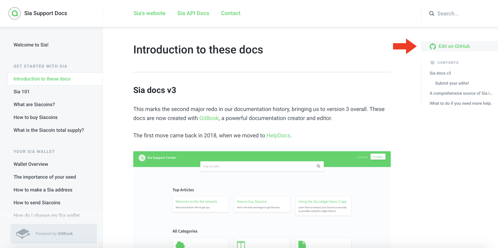
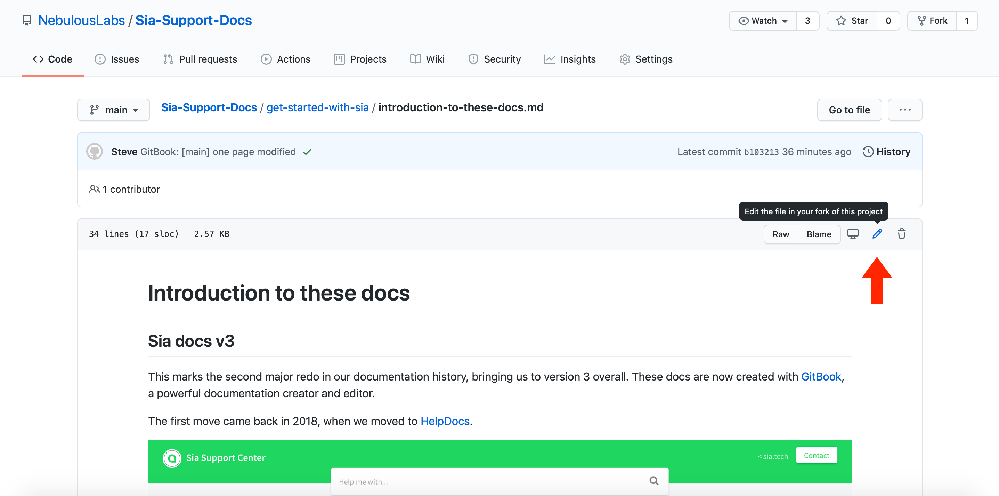
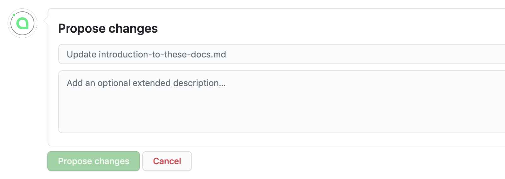

# Introduction to these docs

## Uplo docs v3

This marks the second major redo in our documentation history, bringing us to version 3 overall. These docs are now created with [GitBook](https://www.gitbook.com), a powerful documentation creator and editor.

The first move came back in 2018, when we moved to [HelpDocs](https://www.helpdocs.io).

HelpDocs was great, and I highly recommend it if you need a simple and flexible knowledge base. It served over a million article views for us during its time in use and provided a high level of support for our community.

For us, the move came from two sources: a desire to get our documentation into a more powerful platform, and to allow our community the ability to contribute to docs as well.

With GitBook, we are addressing a primary issue that our previous documentation faced: us. Keeping docs up to date is no small task, and GitBook allows anyone in the community to submit an edit to a document, or even a completely new article on their own. While we still need to review and approve submissions, the pipeline to getting docs updated is significantly cleaner than it used to be.

### Submit your edits!

You can edit these docs by submitting a proposal in the [GitHub repo](https://github.com/NebulousLabs/Uplo-Support-Docs). The simplest way is to click **Edit on GitHub** which appears in the upper right corner of every page.

You'll be taken to GitHub, which is a website that lets multiple people collaborate on code. The code, in this case, is our support document.

Login or create a GitHub account, then click **Edit the file in your fork of this project**.

Because you're contributing, you're not directly editing the file. This helps prevent people from vandalizing the site. You're making a fork of the support docs, which is your own little version of them where can you make any edits you want.

Once you make your changes, scroll down to the bottom. Add a title to your edits, and a description that lets us know what you're changing and why. Click **Propose changes**.

This sends it to us. It won't be live right away – we have to review and approve your edits first. But this gives the community an incredible way to contribute to Uplo documentation.

## A comprehensive source of Uplo information

The info in these docs has been taken from a number of sources, primarily the previous Uplo Support Center and community-driven sites like the Uplo Wiki, SiaStats, and SiaSetup. Thanks to these sites and the many others that have contributed to the Uplo ecosystem over the years.

This site is being developed simultaneously as another brand-new Uplo/Skynet resource takes shape - the Skynet Wiki. While this site can be updated by our users, a community never suffers from having too many resources. Where this site takes a targeted approach to on-boarding new users and getting them up and running, another site might take a more philosophical approach. Yet another might focus on metrics. There's nothing wrong with redundancy – the entire Uplo network is based on it.

## What to do if you need more help.

Couldn’t find your answer here? Don’t worry, we have more support options for you.

Join the \#help channel in [the Uplo Discord server.](https://discord.gg/uplo) We have a huge community that loves helping users with their issues.

You can also [send us an email.](mailto:hello@uplo.tech) We’ll respond as soon as we can.

