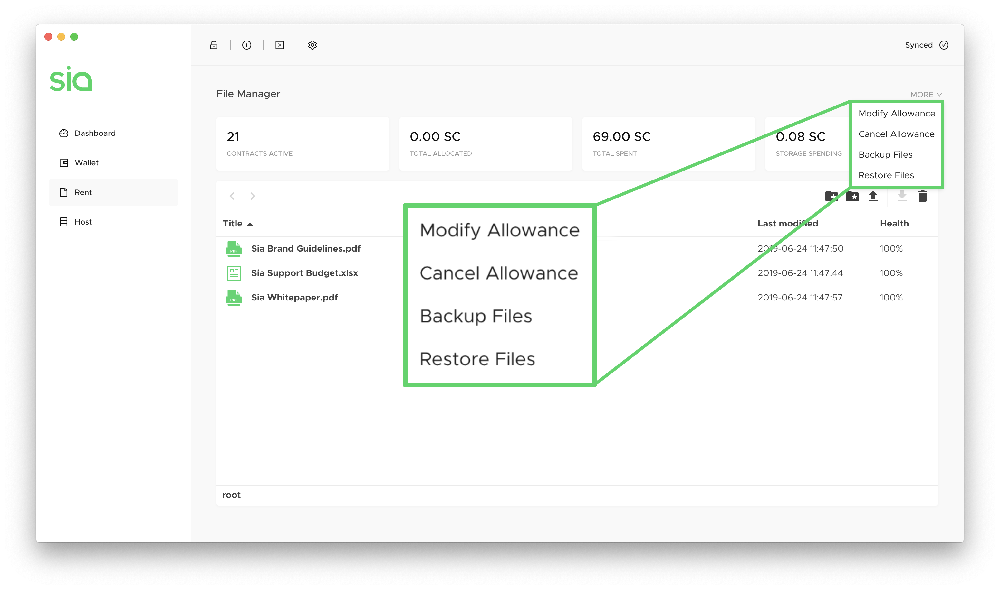
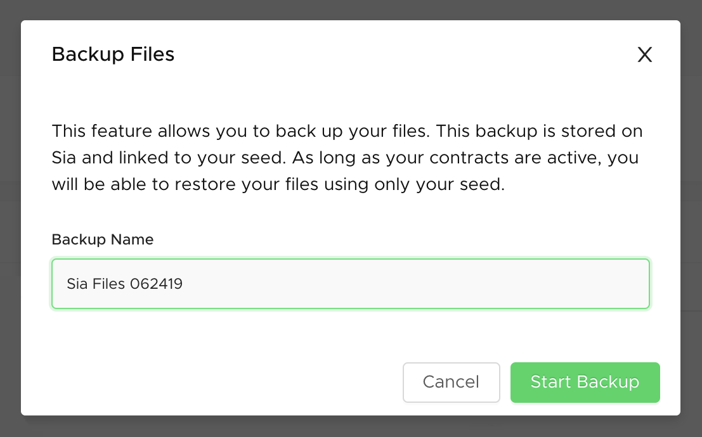
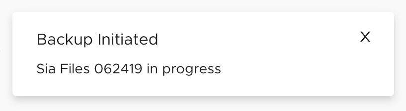
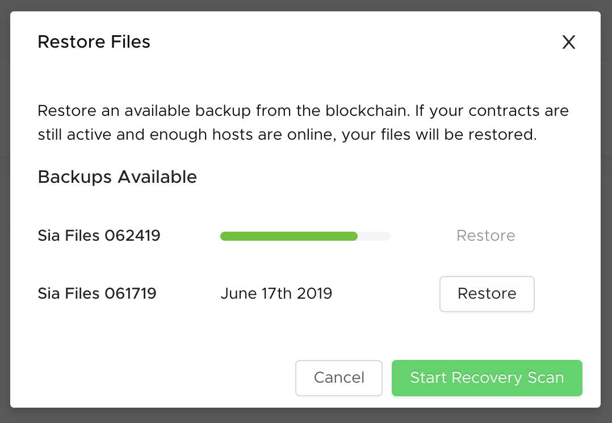
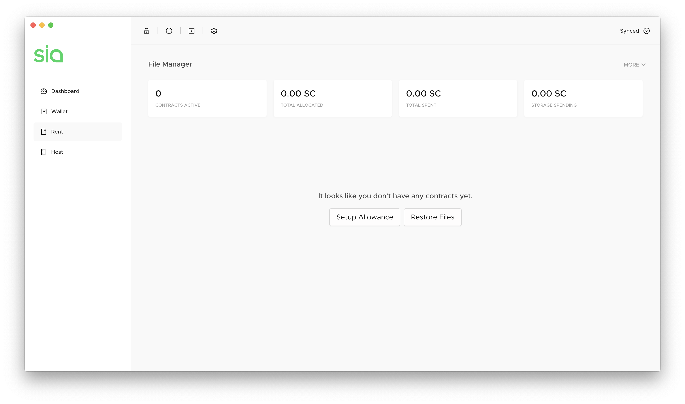
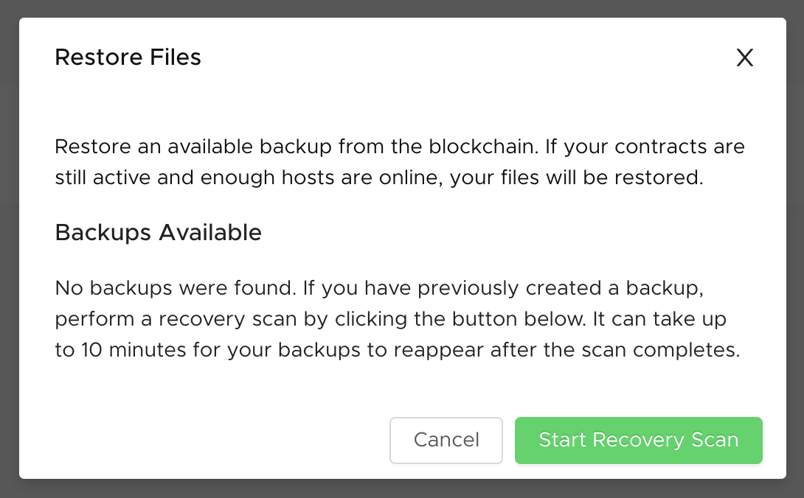
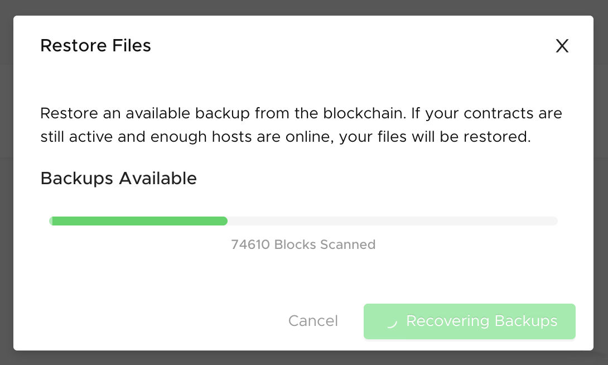
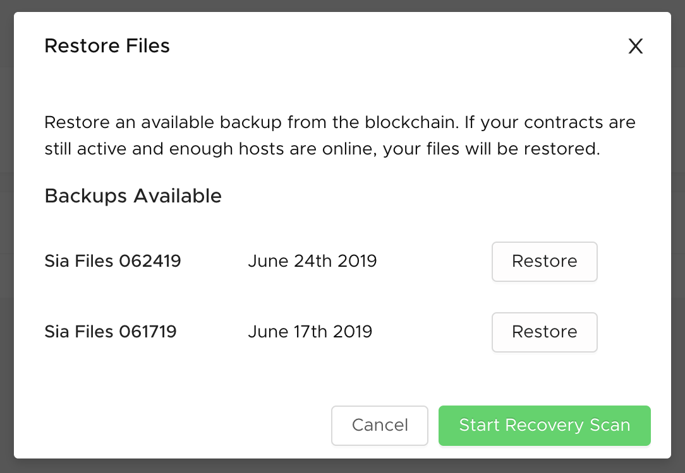

# How to back up and restore your files

With the initial release of Uplo, we will have seed-based file recovery. This feature lets you create a metadata snapshot of your current files, which is stored on the Uplo network and linked to your seed. As long as your contracts are active, you can then use this backup to restore your files at any future date and from any \(preferably empty\) Uplo node.

When your files are on Uplo, they're on the most private, secure network in the world. With seed-based file recovery, they're now also recoverable anywhere, anytime.

File backups are meant to be used to restore files in a brand new instance of Uplo, but can also be accessed in your current Uplo node.


Your contracts need to be active, which means Uplo isn't totally fire-and-forget just yet. You still need to boot Uplo up every few weeks to renew your allowance and contracts.


## Back up your files in Uplo-UI

### **Create your backup**

After you've [uploaded files to Uplo](https://github.com/DavidMGilbert/uplo-support-docs/tree/7d49a88dcb3b035d374d7df410f395a22d2df2d1/renting/how-to-rent-storage-on-uplo.md), go to the Rent tab and click **More**. You've got two new options, Backup Files and Restore Files. Click **Backup Files**.

Name your backup file, and click **Start Backup**.

Uplo now takes a snapshot of your current files and stores it in the cloud. You'll see a notification pop up in the upper right corner to let you know.

### View your backups

Just created your first backup? You can verify that Uplo's got it.

Click on **More** and go to **Restore Files** to see your available backups. If any backups are currently being taken, you'll see a green progress bar. It can take a while for a backup to complete, so check back later if it's not done. Completed backups show with the date they were taken, and an option to restore them.

### Restore your backup

File backups are typically used to restore your files in a new instance of Uplo if the one you were previously using had issues. If you haven't set an allowance or uploaded files in Uplo yet, you can choose **Restore Files** as soon as you go to the Rent tab.

Otherwise, get to **Restore Files** from More.

Uplo needs to scan for your contracts and your backups. Click **Start Recovery Scan**.

Uplo will scan for your contracts and available backups. You'll see a progress bar indicating how many blocks it has scanned.

Wait for the scan to complete. Uplo might find your backups right away, but it might need some time. Give Uplo up to 10 minutes after the scan completes to locate your backups. They'll appear in the window once they've been found. If after 10 minutes you don't see them, click **Start Recovery Scan** again.

Uplo has found your backups. Click **Restore** next to the one you want. Feel free to close this window, or reopen it to check back - your files will begin to appear in the file manager in Uplo over the next few minutes.

There's one last step - check your allowance to make sure it's set. Uplo needs your allowance to be able to spend your UploCoins on contracts and download bandwidth to get your files back. Once that's done, you're good to go!

