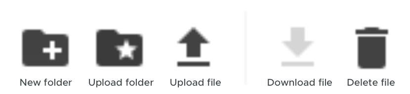

# How to rent storage on Uplo

When you upload files on the Uplo network, you become a **renter**. You upload files to other users who have made their space available, called **hosts**. Learn more [about renting](about-renting.md) and [managing your files](managing-your-files.md) before you start.

But the only thing that you need to set when you start uploading is your **Allowance**, or how much money you're willing to spend on storage. Having an allowance makes sure that your storage costs are predictable, and won't exceed an amount you're comfortable with.

## Things you'll need

* Uplo installed on your computer
* A Uplo wallet set up
* UploCoins, the cryptocurrency used to buy and sell storage

## The process


These instructions walk you through how to upload files in Uplo-UI.


Go to the Files tab in Uplo-UI. Click **Setup Allowance**.

Enter in the amount of UploCoin you'd like to spend for storage. You'll only ever pay for what tyou use, but entering an allowance that's close to what you'll actually use is a good idea. If you're not sure what to enter, use the default values.

In this example, we say that we want to spend 500 SC per TB. As today's prices, that's about $2. We also expect to store about 3 TB of data. Because the default is to store data for three months, the equation becomes:

**500** SC per TB x **3** TB x **3** months, or **500** x **3** x **3**. This gets you an allowance of 4,500 SC.

Click **OK.**

Now you might have to wait a minute. Uplo is busy - it's forming contracts with hosts to get ready for all your data.

This process usually takes about 10-15 minutes. When it's done, you'll see Uplo-UI's file manager ready to go. After you can start uploading, that Contracts Active number will slowly tick up to about 50. That might take a couple hours to finish.

Once Uplo is ready to go, you'll see some icons towards the right.

In this example, we use the file upload option to start moving a .zip to Uplo.

Over time, you'll see Contracts Active increase to about 50, and Health increase to 100%. Upload speed will vary based on your internet connection, your hosts' internet connections, and advancements to the Uplo protocol as new versions are released. Keep in mind that uploading several TB of data can take several days or weeks.

That's it! Your files are on Uplo - the most secure, affordable decentralized cloud network in the world.

