# How to download and install Uplo-UI

Learn how to install Uplo-UI on Windows, Linux, or MacOS.

## Things You'll Need

* A desktop or notebook computer with a decent amount of available storage space. As of January 2021, you need about 24 GB for the Uplo blockchain to download. This file will only get larger, so allocate some space to be able to grow with Uplo.
* A basic knowledge of your computer's file structure.

### Find the right download for you 

Go to [our downloads page](http://uplo.tech/get-started). You'll see two options, Uplo-UI and Uplo Daemon. Uplo-UI is our user-friendly app, while Uplo Daemon is for users comfortable with command-line interfaces. Download Uplo-UI for your operating system by clicking the correct OS name.

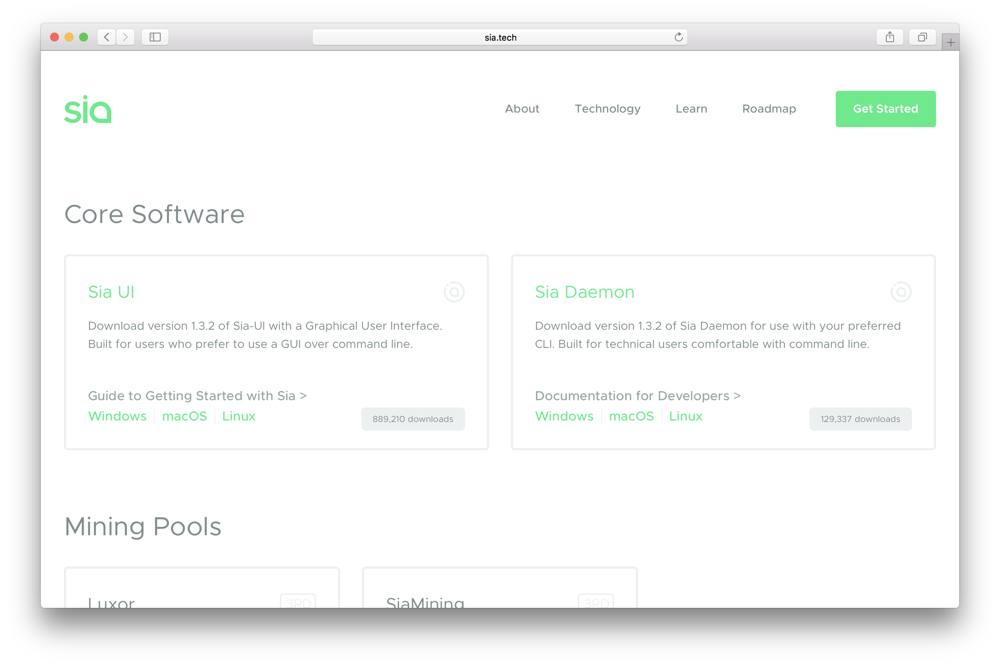

Now either continue straight through to installing on [Windows or Linux](how-to-download-and-install-uplo-ui.md#installation-windows-and-linux), or skip ahead to install on [MacOS](how-to-download-and-install-uplo-ui.md#installation-macos).

## Installation: Windows and Linux

The process for Windows and Linux is very similar. The result of your download will be an `.exe` or Linux executable file. Double click it.

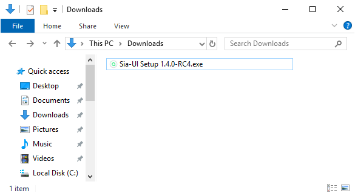

Before Uplo-UI launches, you'll likely see a warning that the app is from an unknown publisher. This is standard whenever you try to open an app that is not on your OS developer's approved list. In this case, Uplo-UI is from Nebulous, the company the employs the Uplo development team. Click **Run.**

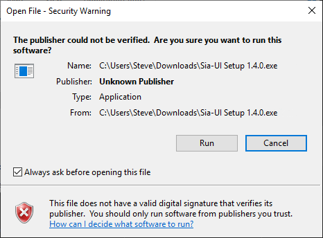

Uplo-UI will inform you that it's installing.

Your computer is going to double-check with you about installing Uplo-UI. If you see: `Do you want to allow this app form an unknown publisher to make changes to your device?`, click **Yes.**

Depending on your installed security software, you may also see a warning regarding network access or some other security precaution. In this example, Windows Defender is asking if uplod.exe, the primary file that Uplo uses to operate, is allowed to communicate on the network. Click **Allow access.**

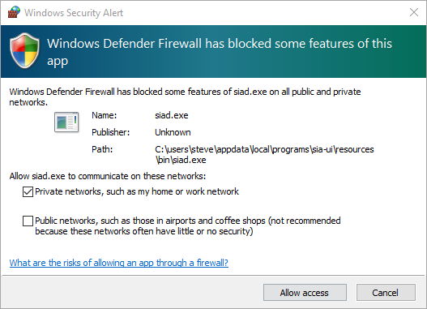

Uplo-UI is now ready to go!

[First time installing? Set up a wallet.](how-to-make-a-new-wallet-in-uplo-ui.md)

## Installation: macOS

The result of your download on macOS will be a `.dmg` file, typically in your Downloads folder. Access your Finder and navigate to your Downloads folder to locate it. In this example, the file is called `Uplo-UI-1.4.0.dmg`. This can vary depending on the version.

Double click on this file to start the installation.

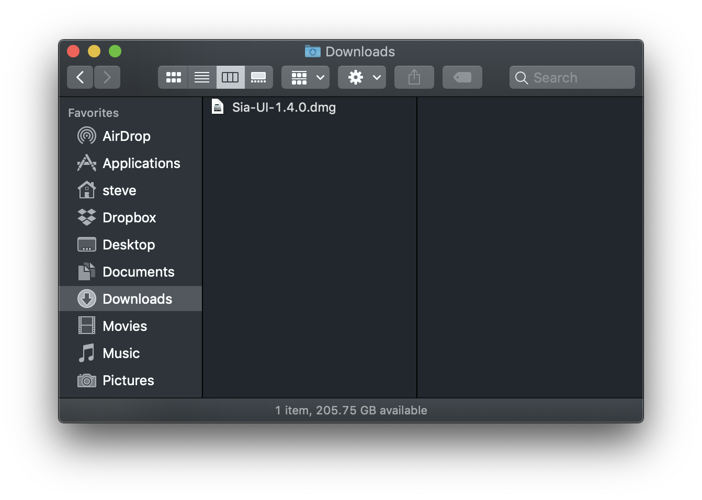

A new window will appear, with the Uplo-UI icon, an arrow, and an image of your Applications folder.

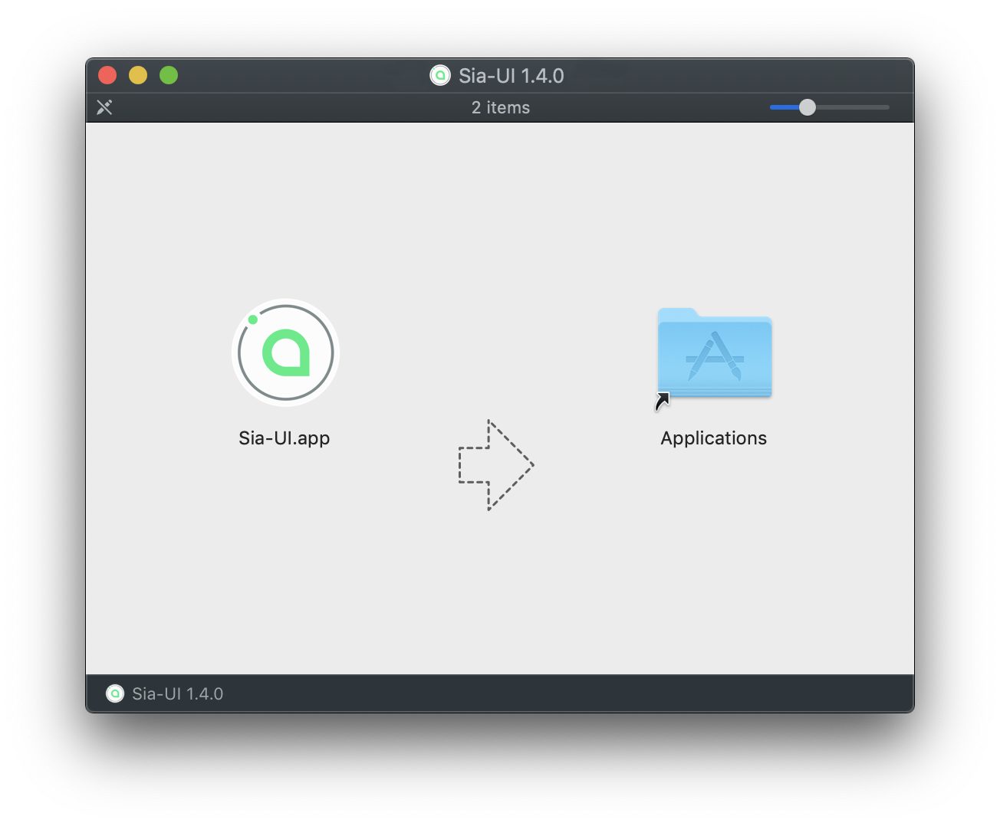

Drag the Uplo-UI icon to the Applications folder and let go. Uplo-UI has now been installed.

NoteTipWarningIf you had another version of Uplo-UI previously installed, you'll be asked to overwrite it. It's ok to do this - you're installing the latest version.

You can now open your Applications folder from your Finder to locate the app.

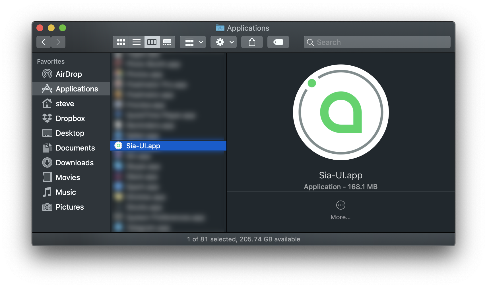

When you first attempt to open Uplo-UI, you'll likely see a warning that you are opening an app from an unidentified developer. This is standard whenever you try to open an app that is not on Apple's approved list. Click **OK.**

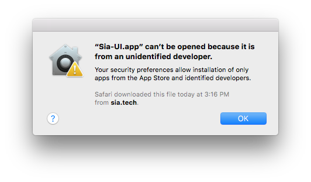

As of macOS 10.15 Catalina, you may be notified that Uplo-UI may contain malicious software. **Uplo-UI is safe to use**, but since it hasn't been pre-verified with Apple they give a warning to be extra safe. To install, either go to System Preferences &gt; Security and Privacy, and click Allow, or right-click the app icon and choose Open.

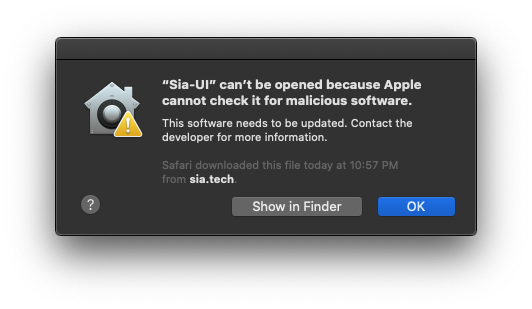

We need to tell your Mac that Uplo-UI is safe to run. Navigate to System Preferences, which can be accessed by clicking on the Apple in the upper left corner of your screen. Once there, click on **Security and Privacy.** This is in the first row of icons.

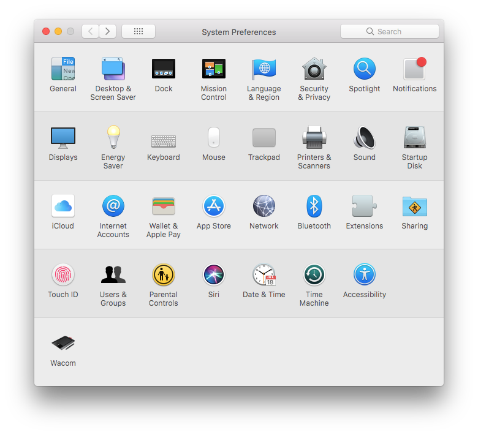

The next screen will open to the General tab, which is exactly where you need to be. Towards the bottom of the window, you'll see the message: "Uplo-UI was blocked from opening because it is not from an identified developer." Click **Open Anyway** to the right.

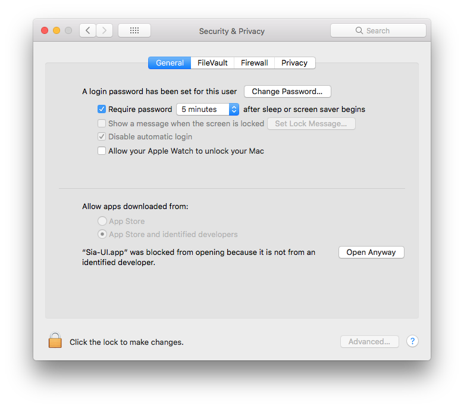

You might see one more message letting you know that Uplo-UI is from an unidentified developer. Click **Open.**

Uplo-UI is now ready to go!

[First time installing? Set up a wallet.](how-to-make-a-new-wallet-in-uplo-ui.md)

