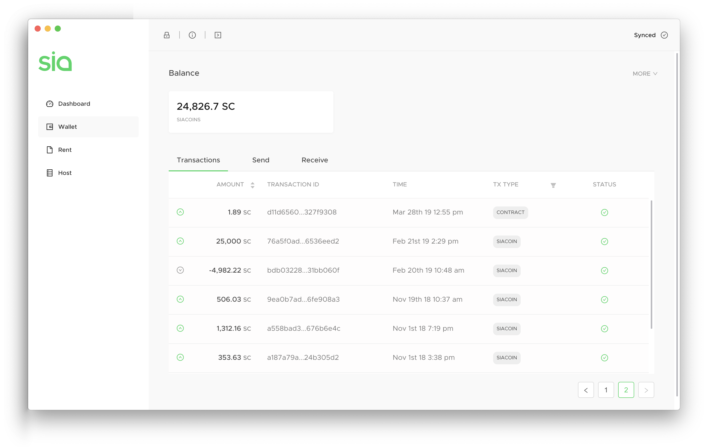
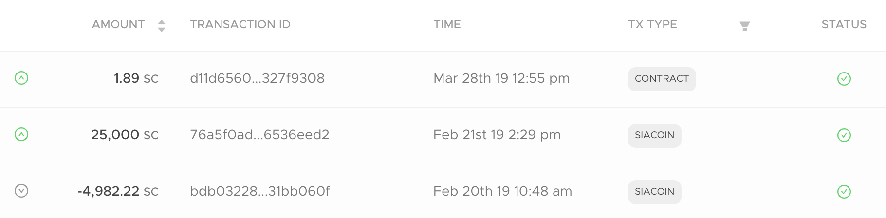

# Wallet overview

Uplo-UI and `uploc` are the best places to store your UploCoins. They're also the only official apps made by the developers of the Uplo network.

[Download Uplo.](http://uplo.tech/get-started)

Uplo-UI allows you to store UploCoins in a secure wallet, or rent or sell storage space on the Uplo network. `uploc` is a command-line client for Uplo, and is only recommended for advanced users.

Uplo-UI allows you to store UploCoins in a secure wallet, or rent or sell storage space on the Uplo network. `uploc` is a command-line client for Uplo, and is only recommended for advanced users.

[Download Uplo.](http://uplo.tech/get-started)

Your wallet gives you access to see your balance and transaction history, and the ability to send or receive UploCoin to any other Uplo user.

Here's what a typical Uplo-UI wallet looks like.

Your **balance** is at the top. This is the current amount of UploCoins in your wallet, and can fluctuate quite a bit depending on how you use Uplo. If you own any UploFunds, they show up next to this.

## The Transactions tab

Every transaction is broken into a few categories - the Amount, Transaction ID, Time, TX Type, and Status.



The amount of UploCoins entering or leaving your wallet.



Use these to look up your transaction in a Uplo blockchain explorer. The transaction IDs are shortened, but you can hover over them to see the full ID. You can also copy and paste while you do this.



The date and time the transaction was made.



The type of transaction that took place. Possible values are UploCoin, Siafund, Contract, Proof, Revision, Block, Defrag, and Setup.



While your transaction is confirming, you'll see 0/6, then 1/6, and so on. Once you reach six confirmations, you'll see the green checkmark like above and your transaction is considered confirmed.



Near the upper right corner, you'll see a button that says `More`. Click on this to get some additional wallet options.

**View Seed** shows you your seed in case you need to see it again.

**Change Password** lets you set a custom password for your wallet, instead of using your Uplo seed. [Learn about the pros and cons of a custom password.](how-do-i-change-my-uplo-wallet-password.md)

## Be careful

There are plenty of scams in the cryptocurrency space. Make sure the only software wallet you use to store your UploCoin is the official app downloaded from that link above or [our GitLab page.](https://github.com/uplo-tech/uplo-UI/tags) There are some other great recommendations you can get from [our community](https://discord.gg/uplo), but we can't guarantee that any other software wallet will safely store your UploCoins.

