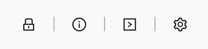

# How do I uninstall Uplo-UI?

## Sorry to see you go!

If you're done with Uplo-UI, you can uninstall easily.

There are two things you need to remove — the application, and the associated data folders.


Deleting your data folders means Uplo is gone - blockchain and everything. You can always [restore your wallet](how-to-restore-a-wallet-from-a-seed-in-uplo-ui.md), though.


## Windows

Uplo-UI on Windows has a built-in uninstaller that will do it for you. It can be found in the default install location - `user/AppData/Local/Programs/Uplo-UI`

Using this will delete Uplo and all the associated data folders.

You can also use Add or Remove Programs app from the System Settings. Uninstalling from here will leave the data folders intact.

## Mac and Linux

On Mac and Linux, you can just delete the app from your Applications folder. You'll then need to delete the data folders.

In Uplo-UI version 1.4.0 and later, there's an easy way to find this. Click on the **Info** button at the top of Uplo-UI.

Then click on **Show Uplo Data** or **Open Data Folder** \(version dependent\)**.**

You'll be taken to your computer's `/uplo` folder. Delete the parent folder to this, `/Uplo-UI`.

## Data folder locations

If you're having trouble and can't get to your Uplo data from Uplo, they can also be found in the following locations:

**Windows:** `%UserProfile%\AppData\Roaming\Uplo-UI\`

**Mac:** `~/Library/Application Support/Uplo-UI/`

**Linux:** `~/.config/Uplo-UI/`

