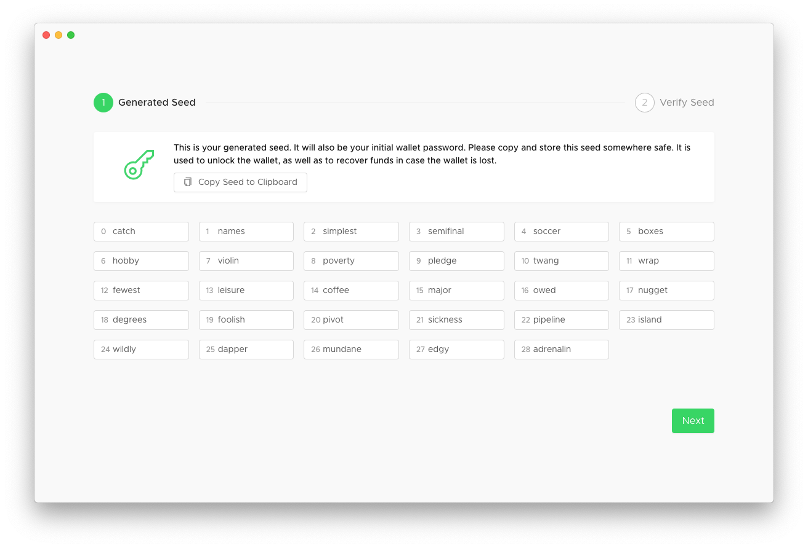
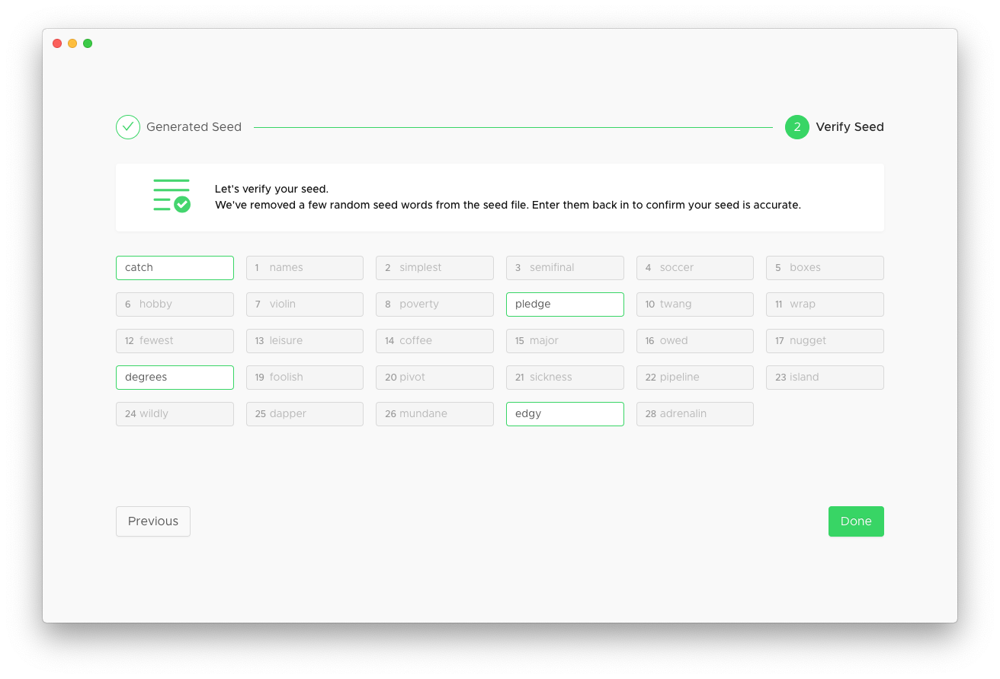
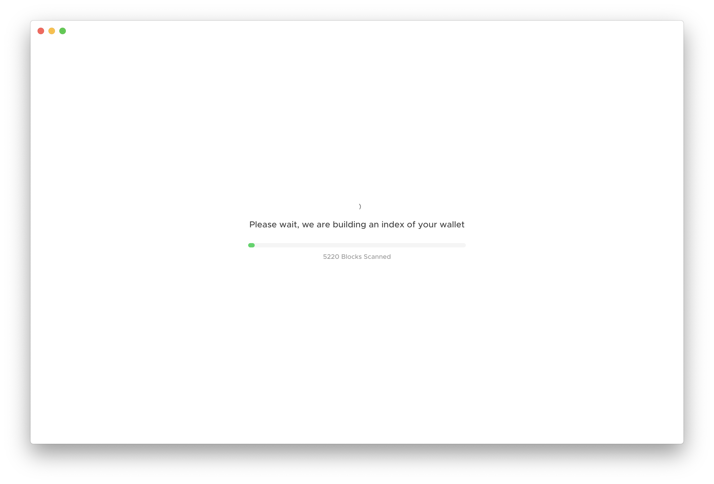
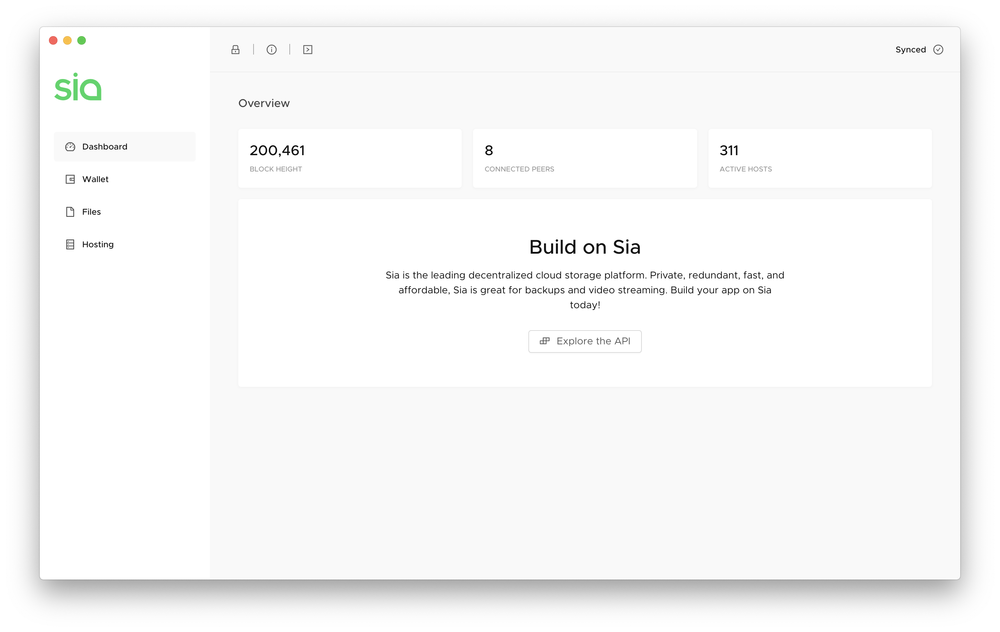
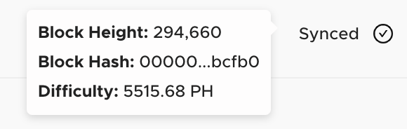
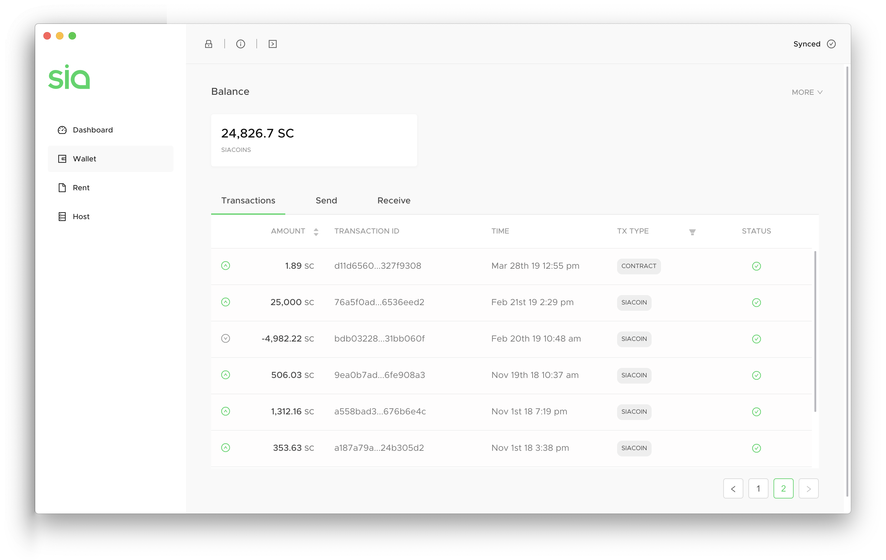

# How to make a new wallet in Uplo-UI

Learn how to make a new wallet in Uplo-UI. This set of instructions assumes that you are setting up a new wallet in Uplo-UI for the first time. If you need to restore an existing wallet, [learn how here.](how-to-restore-a-wallet-from-a-seed-in-uplo-ui.md)

## Things You'll Need

A desktop or notebook computer with Uplo-UI installed. [Don't have Uplo-UI yet?](http://uplo.tech/get-started)

A secure physical and digital way to safely store a long string of words.

## Create a new wallet

When you first boot up Uplo-UI, you'll be prompted to create a UploCoin wallet. A wallet lets you store UploCoins and is required to be able to upload files to the decentralized network, or rent out your storage space and earn more UploCoins.

After starting Uplo, you'll see this screen. Click **Create new wallet.**

Next, you'll see your seed. Your seed is a string of \(usually 29\) words and is your key to your UploCoin wallet. It's also how you can recover your funds - or in the future, your files - from another computer.

You need to keep your seed safe. Safe means a lot of things to different people – but because your entire UploCoin balance is controlled by your seed, keep both digital and physical copies. Everyone does different things, and everyone has a different risk tolerance. Knowing this, our recommendations are as follows.

**Digitally:** Use a password or biometric \(e.g. fingerprint\) secured app like 1Password or LastPass.

**Physically:** Keep a laminated paper copy stored in a locked safe.


**Loss:** If you lose your seed, your UploCoin balance will be unrecoverable.  
**Theft:** If someone steals your seed, they can easily steal your UploCoin balance.


Ready for a deep dive? [Learn more about the importance of your seed.](../the-importance-of-your-seed.md)

Once you've stored your seed, click **Next.**

You'll then be asked to verify your seed. Uplo-UI will ask you for a random selection of your 29 words to make sure you've copied them down correctly. Enter them in the appropriate blank spaces. You'll see each box outlined in green when you've entered them correctly, and you can go back to the previous screen if you need to double check. Click **Done.**

You might be asked to wait a moment while Uplo-UI works.

When Uplo-UI is ready, you'll be taken the Dashboard. The Dashboard shows you a snapshot of the Uplo network, including your current block height, the number of peers you're connected to, and the number of active hosts on the network.

These numbers will increase over time. Once you're caught up, block height grows by one every 10 minutes or so, active hosts will increase as more people lend their storage space to Uplo, and active peers should stabilize around 7 or 8.

When your block height is fully synced, you'll see **Synced** in the upper right corner. Hover over for more info.

Your wallet is ready! Go to the Wallet tab to check it out.

Your wallet shows you how many UploCoins you currently have, as well as three views: Transactions, Send, and Receive.

[Learn about your UploCoin wallet.](../wallet-overview.md)

